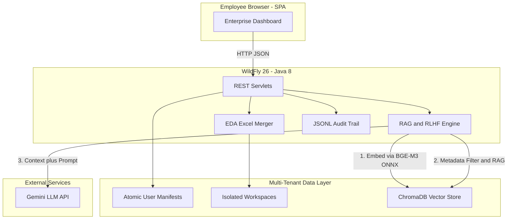

# 🌉 RuleBridge: Enterprise Multi-Tenant RAG Platform

**RuleBridge** is a production-grade, multi-tenant Retrieval-Augmented Generation (RAG) platform engineered for the financial sector. It translates natural-language business requirements into highly specific, domain-specific Java DSL validation rules used in risk management and credit engines.

Domain experts manage, query, and refine AI-generated code through isolated workspaces, while contributing to a centralized, SHA-256-deduplicated "Company Brain."


---

## 📋 Table of Contents

1. [System Overview](#-system-overview)
2. [Architecture](#-architecture)
3. [Hardware & Software Requirements](#-hardware--software-requirements)
4. [Windows Deployment Guide](#-windows-deployment-guide)
5. [Linux Deployment Guide](#-linux-deployment-guide)
6. [Configuration Reference](#-configuration-reference)
7. [Starting the Platform](#-starting-the-platform)
8. [Verification Checklist](#-verification-checklist)
9. [Production Hardening](#-production-hardening)
10. [Backup & Disaster Recovery](#-backup--disaster-recovery)
11. [Monitoring & Logs](#-monitoring--logs)
12. [API Reference](#-api-reference)
13. [Troubleshooting](#-troubleshooting)
14. [FAQ](#-faq)
15. [Deployment Checklist](#-deployment-checklist-for-the-operator)

---

## 🧭 System Overview

| Component | Technology | Purpose |
|---|---|---|
| **Application Server** | WildFly 26.1.3.Final (Java EE 8) | Hosts the REST Servlets and UI |
| **Language** | Java 8 (LTS) | Enterprise compatibility |
| **Embedding Model** | BGE-M3 (ONNX) via DJL | Local CPU-based vectorization |
| **Vector Database** | ChromaDB (v2 REST API) | Stores embeddings and metadata |
| **LLM Provider** | Google Gemini API | Few-shot code generation |
| **Build System** | PowerShell scripts (no Maven) | Compiles and packages WAR |
| **Data Storage** | Local filesystem + ChromaDB | Tenant workspaces + vectors |
| **Audit Trail** | Append-only JSONL | Immutable compliance logging |

### Key Features

- **Multi-Tenant Workspaces** — Cryptographically isolated per employee via metadata filtering.
- **Global Brain (SHA-256 Deduplication)** — Identical rules are embedded exactly once across the entire organization.
- **Human-in-the-Loop (RLHF)** — Approve, Reject, Revise actions are instantly vectorized and fed back into future prompts.
- **Immutable Audit Trail** — Thread-safe, append-only JSONL logger with XSS protection.
- **Context Transparency** — Users see exactly which Few-Shot examples the AI used, including their source (private file, Global Brain, or historical feedback).
- **Chaos-Engineered Reliability** — Atomic file I/O, transactional rollbacks, concurrent-safe manifests.

---

## 🏗️ Architecture



### Request Lifecycle

1. Browser POSTs prompt + settings to `/RuleBridge/generate`
2. `GenerateServlet` resolves per-request overrides (temperature, model, topK)
3. `Engine` embeds the prompt with local BGE-M3 ONNX (1024-dim vector)
4. ChromaDB is queried with a `$in` metadata filter scoped to the user's selected files
5. Optionally the Global Brain is queried and merged with private results
6. Results are deduplicated by rule code, sorted by cosine distance
7. A Few-Shot prompt is constructed (system instruction + examples)
8. Gemini API returns the DSL code
9. `AuditLogger` appends a record to the JSONL ledger
10. Response is returned to the browser

---

## 💻 Hardware & Software Requirements

### Minimum Hardware (per VM)

| Resource | Minimum | Recommended |
|---|---|---|
| **CPU** | 4 cores | 8 cores |
| **RAM** | 8 GB | 16 GB |
| **Disk** | 40 GB SSD | 100 GB SSD |
| **Network** | Outbound HTTPS to `generativelanguage.googleapis.com:443` | Low-latency connection |

> **Note:** The BGE-M3 ONNX model loads ~2 GB into memory at startup. The JVM heap must be configured to `-Xms2g -Xmx4g` minimum.

### Supported Operating Systems

- **Windows:** Windows Server 2019 / 2022 (Desktop Experience or Core)
- **Linux:** Ubuntu 20.04 / 22.04 LTS, Debian 11/12, RHEL 8/9, CentOS Stream 8/9

### Required Software (will be installed during deployment)

| Software | Version | Purpose |
|---|---|---|
| **Java JDK** | 8 (LTS, e.g. Eclipse Temurin 8u402) | Runtime |
| **WildFly** | 26.1.3.Final | Application server |
| **Python** | 3.9+ | ChromaDB host |
| **ChromaDB** | 0.4.x or newer (via pip) | Vector database |
| **Git** | Latest | Source code retrieval |

---

## 🪟 Windows Deployment Guide

### Prerequisites

Log into the VM as an Administrator. Open PowerShell as Administrator for all commands.

### Step 1: Install Java 8

```powershell
# Download Eclipse Temurin JDK 8
Invoke-WebRequest -Uri "https://github.com/adoptium/temurin8-binaries/releases/download/jdk8u402-b06/OpenJDK8U-jdk_x64_windows_hotspot_8u402b06.msi" -OutFile "$env:TEMP\jdk8.msi"

# Silent install to C:\java
Start-Process msiexec.exe -ArgumentList '/i', "$env:TEMP\jdk8.msi", '/quiet', 'INSTALLDIR=C:\java', 'ADDLOCAL=FeatureMain' -Wait

# Set system environment variables
[System.Environment]::SetEnvironmentVariable("JAVA_HOME", "C:\java", "Machine")
$currentPath = [System.Environment]::GetEnvironmentVariable("Path", "Machine")
if ($currentPath -notlike "*C:\java\bin*") {
    [System.Environment]::SetEnvironmentVariable("Path", "$currentPath;C:\java\bin", "Machine")
}

# Refresh current session
$env:JAVA_HOME = "C:\java"
$env:Path = "$env:Path;C:\java\bin"

# Verify
java -version
```

Expected output: `openjdk version "1.8.0_402"` (or similar).

### Step 2: Install WildFly 26.1.3.Final

```powershell
# Create installation root
New-Item -ItemType Directory -Force -Path "D:\wildfly" | Out-Null

# Download and extract WildFly
Invoke-WebRequest -Uri "https://github.com/wildfly/wildfly/releases/download/26.1.3.Final/wildfly-26.1.3.Final.zip" -OutFile "$env:TEMP\wildfly.zip"
Expand-Archive -Path "$env:TEMP\wildfly.zip" -DestinationPath "D:\wildfly" -Force

# Verify structure exists
Test-Path "D:\wildfly\wildfly-26.1.3.Final\bin\standalone.bat"
```

### Step 3: Configure WildFly JVM Memory

Edit the startup configuration to allocate sufficient memory for the ONNX model:

```powershell
$confFile = "D:\wildfly\wildfly-26.1.3.Final\bin\standalone.conf.bat"
$content = Get-Content $confFile -Raw

# Replace the default JAVA_OPTS line
$content = $content -replace 'set "JAVA_OPTS=.*?"', 'set "JAVA_OPTS=-server -Xms2g -Xmx4g -XX:MetaspaceSize=256m -XX:MaxMetaspaceSize=512m -Djava.net.preferIPv4Stack=true -Djboss.modules.system.pkgs=org.jboss.byteman -Djava.awt.headless=true -Dfile.encoding=UTF-8"'

Set-Content $confFile -Value $content -NoNewline
```

### Step 4: Bind WildFly to All Interfaces (allow remote access)

By default WildFly binds to `127.0.0.1`. For a server VM, bind to `0.0.0.0`:

```powershell
$standaloneXml = "D:\wildfly\wildfly-26.1.3.Final\standalone\configuration\standalone.xml"
(Get-Content $standaloneXml) -replace 'jboss\.bind\.address:127\.0\.0\.1', 'jboss.bind.address:0.0.0.0' | Set-Content $standaloneXml
```

### Step 5: Create a WildFly Management User

```powershell
& "D:\wildfly\wildfly-26.1.3.Final\bin\add-user.bat" -u admin -p "YourStrongPassword123!" -s
```

### Step 6: Install Python and ChromaDB

```powershell
# Install Python 3.11 silently
Invoke-WebRequest -Uri "https://www.python.org/ftp/python/3.11.9/python-3.11.9-amd64.exe" -OutFile "$env:TEMP\python.exe"
Start-Process -FilePath "$env:TEMP\python.exe" -ArgumentList '/quiet', 'InstallAllUsers=1', 'PrependPath=1', 'Include_test=0' -Wait

# Refresh path
$env:Path = [System.Environment]::GetEnvironmentVariable("Path", "Machine") + ";" + [System.Environment]::GetEnvironmentVariable("Path", "User")

# Install ChromaDB
pip install chromadb

# Verify
chroma --version
```

### Step 7: Prepare Directories for the Application

```powershell
# AI model directory
New-Item -ItemType Directory -Force -Path "D:\models\bge-m3"

# Application data directory
New-Item -ItemType Directory -Force -Path "D:\rulebridge"

# Runtime user data directory (for tenant workspaces and audit logs)
New-Item -ItemType Directory -Force -Path "D:\rulebridge\runtime"
```

### Step 8: Download the BGE-M3 ONNX Model

The BGE-M3 model can be downloaded from HuggingFace. Use the DJL-compatible ONNX export:

```powershell
# Install huggingface_hub for easy download
pip install huggingface_hub

python -c "from huggingface_hub import snapshot_download; snapshot_download(repo_id='BAAI/bge-m3', local_dir='D:/models/bge-m3', allow_patterns=['*.onnx', '*.json', '*.model', '*.txt'])"
```

Verify: `D:\models\bge-m3\model.onnx` must exist.

### Step 9: Clone the RuleBridge Repository

```powershell
# Install Git if not already present
winget install -e --id Git.Git --silent

cd D:\rulebridge
git clone https://github.com/YOUR_ORG/RuleBridge.git
cd RuleBridge
```

### Step 10: Configure rulebridge.properties

Edit `D:\rulebridge\RuleBridge\rulebridge.properties`:

```powershell
notepad D:\rulebridge\RuleBridge\rulebridge.properties
```

**Required changes:**

```properties
# ChromaDB connection (same VM)
chroma.host=localhost
chroma.port=8000

# Absolute path to the embedding model
model.path=D:/models/bge-m3

# Absolute path to the master rules Excel file (optional initial dataset)
excel.file-path=D:/rulebridge/RuleBridge/Master_Rules_Audit_Report.xlsx

# Default LLM model and temperature
gemini.model=gemini-3.5-flash-lite
gemini.temperature=0.0
```

### Step 11: Build the WAR File

```powershell
cd D:\rulebridge\RuleBridge
.\compile.ps1
.\build-war.ps1
```

Verify: `D:\rulebridge\RuleBridge\target\RuleBridge.war` must exist.

### Step 12: Deploy to WildFly

```powershell
Copy-Item -Path "D:\rulebridge\RuleBridge\target\RuleBridge.war" -Destination "D:\wildfly\wildfly-26.1.3.Final\standalone\deployments" -Force
```

### Step 13: Configure Windows Firewall

```powershell
New-NetFirewallRule -DisplayName "RuleBridge HTTP" -Direction Inbound -Protocol TCP -LocalPort 8080 -Action Allow
New-NetFirewallRule -DisplayName "RuleBridge HTTPS" -Direction Inbound -Protocol TCP -LocalPort 8443 -Action Allow
New-NetFirewallRule -DisplayName "WildFly Management" -Direction Inbound -Protocol TCP -LocalPort 9990 -Action Allow
# ChromaDB should NOT be exposed externally - only localhost access
```

### Step 14: Register Services with NSSM (run on boot)

Download NSSM (Non-Sucking Service Manager):

```powershell
Invoke-WebRequest -Uri "https://nssm.cc/release/nssm-2.24.zip" -OutFile "$env:TEMP\nssm.zip"
Expand-Archive -Path "$env:TEMP\nssm.zip" -DestinationPath "C:\nssm" -Force

# Create log directory
New-Item -ItemType Directory -Force -Path "D:\rulebridge\logs"

# ChromaDB service
& "C:\nssm\nssm-2.24\win64\nssm.exe" install ChromaDB "C:\Program Files\Python311\Scripts\chroma.exe" "run --host 127.0.0.1 --port 8000 --path D:\rulebridge\chroma_data"
& "C:\nssm\nssm-2.24\win64\nssm.exe" set ChromaDB AppStdout "D:\rulebridge\logs\chroma.out.log"
& "C:\nssm\nssm-2.24\win64\nssm.exe" set ChromaDB AppStderr "D:\rulebridge\logs\chroma.err.log"

# WildFly service
& "C:\nssm\nssm-2.24\win64\nssm.exe" install WildFly "D:\wildfly\wildfly-26.1.3.Final\bin\standalone.bat"
& "C:\nssm\nssm-2.24\win64\nssm.exe" set WildFly AppDirectory "D:\wildfly\wildfly-26.1.3.Final\bin"
& "C:\nssm\nssm-2.24\win64\nssm.exe" set WildFly AppStdout "D:\rulebridge\logs\wildfly.out.log"
& "C:\nssm\nssm-2.24\win64\nssm.exe" set WildFly AppStderr "D:\rulebridge\logs\wildfly.err.log"
& "C:\nssm\nssm-2.24\win64\nssm.exe" set WildFly DependOnService ChromaDB
```

Start the services:

```powershell
Start-Service ChromaDB
Start-Service WildFly
```

---

## 🐧 Linux Deployment Guide

### Prerequisites

Log into the VM as `root` or a user with `sudo` privileges.

### Step 1: Install Java 8

**Ubuntu / Debian:**

```bash
sudo apt update
sudo apt install -y openjdk-8-jdk unzip git curl
java -version
```

**RHEL / CentOS / AlmaLinux:**

```bash
sudo dnf install -y java-1.8.0-openjdk-devel unzip git curl
java -version
```

### Step 2: Create a dedicated service user

```bash
sudo useradd -r -m -d /opt/rulebridge -s /bin/bash rulebridge
sudo mkdir -p /opt/rulebridge /opt/wildfly /opt/models /opt/rulebridge/logs /opt/rulebridge/chroma_data
sudo chown -R rulebridge:rulebridge /opt/rulebridge /opt/models
```

### Step 3: Install WildFly 26.1.3.Final

```bash
cd /tmp
wget https://github.com/wildfly/wildfly/releases/download/26.1.3.Final/wildfly-26.1.3.Final.tar.gz
sudo tar -xzf wildfly-26.1.3.Final.tar.gz -C /opt/wildfly --strip-components=1
sudo chown -R rulebridge:rulebridge /opt/wildfly
```

### Step 4: Configure WildFly JVM Memory

Edit `/opt/wildfly/bin/standalone.conf`:

```bash
sudo nano /opt/wildfly/bin/standalone.conf
```

Find the line starting with `JAVA_OPTS=` and replace it with:

```bash
JAVA_OPTS="-server -Xms2g -Xmx4g -XX:MetaspaceSize=256m -XX:MaxMetaspaceSize=512m -Djava.net.preferIPv4Stack=true -Djboss.modules.system.pkgs=org.jboss.byteman -Djava.awt.headless=true -Dfile.encoding=UTF-8"
```

### Step 5: Bind WildFly to All Interfaces

```bash
sudo sed -i 's/jboss\.bind\.address:127\.0\.0\.1/jboss.bind.address:0.0.0.0/g' /opt/wildfly/standalone/configuration/standalone.xml
```

### Step 6: Create a WildFly Management User

```bash
sudo -u rulebridge /opt/wildfly/bin/add-user.sh -u admin -p "YourStrongPassword123!" -s
```

### Step 7: Install Python and ChromaDB

```bash
# Ubuntu / Debian
sudo apt install -y python3 python3-pip python3-venv

# RHEL / CentOS
sudo dnf install -y python3 python3-pip

# Create a virtual environment for ChromaDB (recommended)
sudo python3 -m venv /opt/rulebridge/chroma-venv
sudo chown -R rulebridge:rulebridge /opt/rulebridge/chroma-venv
sudo -u rulebridge /opt/rulebridge/chroma-venv/bin/pip install chromadb huggingface_hub
```

### Step 8: Download the BGE-M3 ONNX Model

```bash
sudo -u rulebridge /opt/rulebridge/chroma-venv/bin/python -c "
from huggingface_hub import snapshot_download
snapshot_download(
    repo_id='BAAI/bge-m3',
    local_dir='/opt/models/bge-m3',
    allow_patterns=['*.onnx', '*.json', '*.model', '*.txt']
)
"
```

Verify: `/opt/models/bge-m3/model.onnx` must exist.

### Step 9: Clone the RuleBridge Repository

```bash
cd /opt/rulebridge
sudo -u rulebridge git clone https://github.com/YOUR_ORG/RuleBridge.git
cd RuleBridge
```

### Step 10: Configure rulebridge.properties

```bash
sudo -u rulebridge nano /opt/rulebridge/RuleBridge/rulebridge.properties
```

**Required changes:**

```properties
chroma.host=localhost
chroma.port=8000
model.path=/opt/models/bge-m3
excel.file-path=/opt/rulebridge/RuleBridge/Master_Rules_Audit_Report.xlsx
gemini.model=gemini-3.5-flash-lite
gemini.temperature=0.0
```

### Step 11: Build the WAR File

PowerShell Core (`pwsh`) is required on Linux:

```bash
# Ubuntu / Debian
sudo apt install -y powershell

# RHEL / CentOS
sudo dnf install -y https://github.com/PowerShell/PowerShell/releases/download/v7.4.2/powershell-7.4.2-1.rh.x86_64.rpm

cd /opt/rulebridge/RuleBridge
sudo -u rulebridge pwsh -Command "./compile.ps1; ./build-war.ps1"
```

Verify: `/opt/rulebridge/RuleBridge/target/RuleBridge.war` must exist.

### Step 12: Deploy to WildFly

```bash
sudo -u rulebridge cp /opt/rulebridge/RuleBridge/target/RuleBridge.war /opt/wildfly/standalone/deployments/
```

### Step 13: Create systemd Services

**ChromaDB service:**

```bash
sudo tee /etc/systemd/system/chromadb.service > /dev/null << 'EOF'
[Unit]
Description=ChromaDB Vector Database
After=network.target

[Service]
Type=simple
User=rulebridge
Group=rulebridge
ExecStart=/opt/rulebridge/chroma-venv/bin/chroma run --host 127.0.0.1 --port 8000 --path /opt/rulebridge/chroma_data
WorkingDirectory=/opt/rulebridge
Restart=always
RestartSec=5
StandardOutput=append:/opt/rulebridge/logs/chroma.out.log
StandardError=append:/opt/rulebridge/logs/chroma.err.log

[Install]
WantedBy=multi-user.target
EOF
```

**WildFly service:**

```bash
sudo tee /etc/systemd/system/wildfly.service > /dev/null << 'EOF'
[Unit]
Description=WildFly Application Server
After=network.target chromadb.service
Requires=chromadb.service

[Service]
Type=simple
User=rulebridge
Group=rulebridge
ExecStart=/opt/wildfly/bin/standalone.sh
WorkingDirectory=/opt/wildfly/bin
Restart=on-failure
RestartSec=10
StandardOutput=append:/opt/rulebridge/logs/wildfly.out.log
StandardError=append:/opt/rulebridge/logs/wildfly.err.log

[Install]
WantedBy=multi-user.target
EOF
```

Enable and start:

```bash
sudo systemctl daemon-reload
sudo systemctl enable chromadb wildfly
sudo systemctl start chromadb
sleep 3
sudo systemctl start wildfly
```

### Step 14: Configure Firewall

**Ubuntu (ufw):**

```bash
sudo ufw allow 8080/tcp   # RuleBridge HTTP
sudo ufw allow 8443/tcp   # RuleBridge HTTPS
sudo ufw allow 9990/tcp   # WildFly management (restrict to admin IPs in prod)
# ChromaDB port 8000 is NOT exposed - only localhost
sudo ufw reload
```

**RHEL / CentOS (firewalld):**

```bash
sudo firewall-cmd --permanent --add-port=8080/tcp
sudo firewall-cmd --permanent --add-port=8443/tcp
sudo firewall-cmd --permanent --add-port=9990/tcp
sudo firewall-cmd --reload
```

---

## ⚙️ Configuration Reference

All configuration is in `rulebridge.properties`. The file is packaged inside the WAR under `WEB-INF/classes/` at build time.

### ChromaDB

| Key | Default | Description |
|---|---|---|
| `chroma.host` | `localhost` | ChromaDB hostname |
| `chroma.port` | `8000` | ChromaDB port |
| `chroma.tenant` | `default_tenant` | ChromaDB tenant name |
| `chroma.database` | `default_database` | ChromaDB database name |
| `chroma.collection` | `rules_collection` | Default collection for legacy mode |
| `chroma.rejected-collection` | `rules_rejected` | Default rejected collection |
| `chroma.connect-timeout-sec` | `10` | TCP connect timeout |
| `chroma.read-timeout-sec` | `30` | Response read timeout |

### Embedding Model

| Key | Default | Description |
|---|---|---|
| `model.path` | *(required)* | Absolute path to BGE-M3 model directory containing `model.onnx` |
| `embedding.batch-size` | `15` | Batch size for embedding during ingestion |

### Excel Data Source

| Key | Default | Description |
|---|---|---|
| `excel.file-path` | *(optional)* | Absolute path to the master rules Excel file for initial seeding |

### LLM (Gemini)

| Key | Default | Description |
|---|---|---|
| `gemini.model` | `gemini-3.5-flash-lite` | Default model ID (overridable per-request from UI) |
| `gemini.temperature` | `0.0` | Default temperature (overridable per-request) |
| `gemini.max-tokens` | `500` | Maximum output tokens per generation |
| `gemini.connect-timeout-sec` | `15` | Connect timeout |
| `gemini.read-timeout-sec` | `60` | Read timeout |

### RAG Parameters

| Key | Default | Description |
|---|---|---|
| `rag.default-top-k` | `3` | Number of Few-Shot examples to retrieve |
| `rag.deduplicate` | `true` | Deduplicate retrieved examples by `code_regle` |

### Resilience

| Key | Default | Description |
|---|---|---|
| `retry.max-attempts` | `4` | Maximum retry attempts for transient failures |
| `retry.base-delay-ms` | `400` | Base delay for exponential backoff |

### Authentication

| Key | Default | Description |
|---|---|---|
| `auth.require-env-key` | `true` | If `true`, `GEMINI_API_KEY` env var is mandatory; server fails fast if missing |
| `auth.persist-interactive-key` | `false` | Whether to persist an interactively-provided key to disk |

### Environment Variables

| Variable | Required | Description |
|---|---|---|
| `GEMINI_API_KEY` | If `auth.require-env-key=true` | Server-side fallback Gemini API key |
| `JAVA_OPTS` | Set by startup scripts | Must include `-Xms2g -Xmx4g -Dfile.encoding=UTF-8` |

---

## ▶️ Starting the Platform

### Windows

```powershell
# Start ChromaDB first (if not a service)
Start-Process -NoNewWindow -FilePath "chroma" -ArgumentList "run","--host","127.0.0.1","--port","8000","--path","D:\rulebridge\chroma_data"

# Wait 5 seconds for ChromaDB to initialize
Start-Sleep -Seconds 5

# Start WildFly
D:\wildfly\wildfly-26.1.3.Final\bin\standalone.bat
```

Or via services (recommended):

```powershell
Start-Service ChromaDB
Start-Service WildFly
```

### Linux

```bash
sudo systemctl start chromadb
sleep 5
sudo systemctl start wildfly
```

---

## ✅ Verification Checklist

Run these commands from the VM itself or from an authorized client:

```bash
# 1. ChromaDB health
curl http://localhost:8000/api/v2/heartbeat
# Expected: {"nanosecond heartbeat": <number>}

# 2. WildFly application endpoint
curl -s -o /dev/null -w "%{http_code}\n" http://localhost:8080/RuleBridge/
# Expected: 200

# 3. WildFly deployments scanner
curl -s -u admin:YourStrongPassword123! http://localhost:9990/management | head -c 100
# Expected: JSON response (management API reachable)

# 4. Engine initialization (check WildFly logs)
grep -E "Embedding model ready|Engine ready and listening" /opt/rulebridge/logs/wildfly.out.log
# Or on Windows: Select-String "Embedding model ready|Engine ready and listening" D:\rulebridge\logs\wildfly.out.log
# Expected: Two lines indicating successful initialization
```

If all four checks pass, open a browser:

```
http://<VM_IP>:8080/RuleBridge/
```

The RuleBridge Enterprise Dashboard should load.

---

## 🛡️ Production Hardening

### TLS / HTTPS

WildFly ships with a self-signed certificate. For production, replace it:

```bash
# Generate a CSR with your CA or use Let's Encrypt
# Then import the signed certificate into WildFly's keystore:
keytool -importcert -file /path/to/signed.crt -keystore /opt/wildfly/standalone/configuration/application.keystore -alias server -storepass <password>
```

Enable HTTPS-only access by editing `standalone.xml` and removing the HTTP listener.

### Restrict Management Console

Bind the WildFly management interface to `127.0.0.1` and expose it only via SSH tunnel:

```bash
sudo sed -i 's/jboss\.bind\.address\.management:.*"/jboss.bind.address.management:127.0.0.1"/g' /opt/wildfly/standalone/configuration/standalone.xml
```

### Filesystem Permissions (Linux)

```bash
sudo chown -R rulebridge:rulebridge /opt/rulebridge /opt/wildfly /opt/models
sudo chmod -R 750 /opt/rulebridge /opt/wildfly
sudo chmod -R 700 /opt/rulebridge/logs
```

### API Rate Limiting

If centralizing the Gemini API key, implement a Servlet Filter that enforces per-user rate limits (tokens-per-minute) based on the model's Free Tier quota. This is on the Phase 2 roadmap.

---

## 💾 Backup & Disaster Recovery

### What to Back Up

| Path | Purpose | Frequency |
|---|---|---|
| `/opt/rulebridge/chroma_data` (Linux) or `D:\rulebridge\chroma_data` (Windows) | ChromaDB vector database (all embeddings and metadata) | Daily |
| `~/.rulebridge_data` (per-user workspaces and manifests) | Tenant-uploaded Excel files and `manifest.json` | Daily |
| `~/.rulebridge/audit_trail.jsonl` | Immutable compliance log | Daily (append-only) |
| `~/.rulebridge/rejected_examples.jsonl` | Rejection history | Daily |
| `/opt/rulebridge/RuleBridge/rulebridge.properties` | Configuration | On change |
| `/opt/wildfly/standalone/configuration/` | WildFly config, keystores, users | On change |

### Backup Script (Linux, run via cron)

```bash
#!/bin/bash
# /opt/rulebridge/backup.sh
set -euo pipefail
BACKUP_DIR="/backup/rulebridge/$(date +%Y-%m-%d)"
mkdir -p "$BACKUP_DIR"

sudo -u rulebridge tar -czf "$BACKUP_DIR/chroma_data.tar.gz" -C /opt/rulebridge chroma_data
sudo tar -czf "$BACKUP_DIR/user_data.tar.gz" -C /home rulebridge 2>/dev/null || true
sudo tar -czf "$BACKUP_DIR/wildfly_config.tar.gz" -C /opt/wildfly/standalone configuration

# Retain only last 30 days
find /backup/rulebridge -maxdepth 1 -type d -mtime +30 -exec rm -rf {} +

echo "[$(date)] Backup completed to $BACKUP_DIR"
```

Install via cron:

```bash
sudo crontab -e
# Add:
0 2 * * * /opt/rulebridge/backup.sh >> /opt/rulebridge/logs/backup.log 2>&1
```

### Restore Procedure

```bash
# 1. Stop services
sudo systemctl stop wildfly chromadb

# 2. Restore ChromaDB
sudo rm -rf /opt/rulebridge/chroma_data
sudo tar -xzf /backup/rulebridge/YYYY-MM-DD/chroma_data.tar.gz -C /opt/rulebridge
sudo chown -R rulebridge:rulebridge /opt/rulebridge/chroma_data

# 3. Restore user data
sudo tar -xzf /backup/rulebridge/YYYY-MM-DD/user_data.tar.gz -C /home

# 4. Start services
sudo systemctl start chromadb
sleep 5
sudo systemctl start wildfly
```

---

## 📊 Monitoring & Logs

### Log Locations

| Log | Location |
|---|---|
| **WildFly stdout** | `/opt/rulebridge/logs/wildfly.out.log` (Linux) or `D:\rulebridge\logs\wildfly.out.log` (Windows) |
| **WildFly stderr** | `/opt/rulebridge/logs/wildfly.err.log` |
| **ChromaDB** | `/opt/rulebridge/logs/chroma.out.log` |
| **Application Audit Trail** | `~/.rulebridge/audit_trail.jsonl` |
| **RuleBridge operational log** | `~/.rulebridge/rulebridge.log` |

### Tail Live Logs

```bash
# Linux
tail -f /opt/rulebridge/logs/wildfly.out.log

# Windows PowerShell
Get-Content D:\rulebridge\logs\wildfly.out.log -Wait
```

### Audit Trail Inspection

```bash
# Last 10 audit entries
tail -n 10 ~/.rulebridge/audit_trail.jsonl | jq

# Filter by user
grep '"userId":"MENDIL"' ~/.rulebridge/audit_trail.jsonl | jq

# Filter by action
grep '"action":"APPROVE"' ~/.rulebridge/audit_trail.jsonl | jq
```

### Health Endpoints

| Endpoint | Purpose |
|---|---|
| `GET http://<host>:8000/api/v2/heartbeat` | ChromaDB liveness |
| `GET http://<host>:9990/health` | WildFly health (if configured) |
| `GET http://<host>:8080/RuleBridge/` | Application reachable |

---

## 🔌 API Reference

Base URL: `http://<host>:8080/RuleBridge`

All responses are JSON. Errors return HTTP 4xx/5xx with body `{"error": "..."}`.

### `POST /generate`

Generate a DSL rule from a natural-language prompt.

**Body (form-urlencoded):**

| Field | Required | Description |
|---|---|---|
| `prompt` | Yes | Natural-language requirement |
| `empId` | Yes | Employee identifier |
| `apiKey` | Yes | Gemini API key (or server falls back to env) |
| `mainCollection` | No | Override private collection name (default: `rules_<empId>`) |
| `rejectedCollection` | No | Override rejected collection name |
| `selectedFiles` | No | Comma-separated `file_id` list or `"all"` |
| `includeGlobal` | No | `true` to include the Global Brain |
| `temperature` | No | Override default (0.0 - 1.0) |
| `model` | No | Override model ID |
| `topK` | No | Override number of Few-Shot examples (1-10) |

**Response:**

```json
{
  "generatedCode": "...",
  "latencySec": 3.42,
  "retrievedContext": [ {}, {} ],
  "retrievedRejected": [ {} ]
}
```

### `POST /upload`

Upload Excel file(s) for ingestion. Multipart/form-data.

**Fields:** `empId`, `fileName`, `exprFile` (required), `ctrlFile` (optional). If both are provided, they are merged by `ExcelMerger` before ingestion.

### `GET /files?empId=<id>`

List files for a user. Returns JSON array of `{id, name, date, rules}`.

### `POST /files`

Delete a file. Fields: `empId`, `action=delete`, `fileId`.

### `POST /feedback`

Record approval or rejection. Fields: `empId`, `action` (`approve` or `reject`), `prompt`, `code`, `reason` (for reject), `mainCollection`, `rejectedCollection`.

### `POST /revise`

Revise previously generated code. Fields: `empId`, `prompt`, `previousCode`, `feedback`, `apiKey`.

### `POST /explain`

Ask a question about a generated rule. Fields: `empId`, `prompt`, `generatedCode`, `question`, `apiKey`, `contextJson`, `rejectedJson`, `qaHistoryJson`.

### `GET /audit`

Returns the full audit trail as a JSON array (newest first).

### `GET /pairs?type={approved|rejected}&mainCollection=...&rejectedCollection=...`

List approved or rejected prompt/code pairs.

### `POST /pairs`

Delete a pair. Fields: `action=delete`, `type`, `id`, `mainCollection`, `rejectedCollection`.

---

## 🩺 Troubleshooting

### Symptom: WildFly starts but `/RuleBridge/` returns 404

**Cause:** WAR did not deploy.
**Check:** `tail /opt/rulebridge/logs/wildfly.out.log | grep -i "rulebridge"`.
**Fix:** Verify the WAR file is in `standalone/deployments/` and that a `RuleBridge.war.deployed` marker file was created by the scanner.

### Symptom: `java.lang.OutOfMemoryError: Java heap space`

**Cause:** Insufficient JVM heap.
**Fix:** Edit `standalone.conf` / `standalone.conf.bat` and set `-Xms2g -Xmx4g`. Restart WildFly.

### Symptom: `Embedding model ready` never appears in logs

**Cause:** BGE-M3 model files are missing or `model.path` is wrong.
**Fix:** Verify `model.onnx` exists in the configured path and that the `rulebridge` user has read access.

### Symptom: ChromaDB queries time out with `SocketTimeoutException`

**Cause:** ChromaDB is not running or the port is blocked.
**Check:** `curl http://localhost:8000/api/v2/heartbeat`.
**Fix:** Restart the ChromaDB service; verify firewall does not block port 8000 even locally.

### Symptom: `Gemini API error: 429`

**Cause:** Rate limit exceeded on the Free Tier.
**Fix:** Switch to a higher-quota model via the Settings modal (`gemini-3.1-flash-lite` as failover), or wait for the daily quota reset.

### Symptom: French accents display as corrupted characters in logs

**Cause:** Log file encoding is not UTF-8.
**Fix:** Confirm `JAVA_OPTS` includes `-Dfile.encoding=UTF-8`. On Windows also run `chcp 65001` in the console before starting WildFly.

### Symptom: `manifest.json` occasionally becomes empty / corrupted

**Cause:** Concurrent writes without atomic I/O.
**Fix:** Already handled by `UserFileManager.java` using `ATOMIC_MOVE`. If observed, check for disk I/O errors on the VM.

### Symptom: Audit trail grows unbounded

**Fix:** Rotate the file with `logrotate` (Linux) or a scheduled task (Windows):

```
/opt/rulebridge/runtime/.rulebridge/audit_trail.jsonl {
    daily
    rotate 365
    compress
    missingok
    notifempty
    copytruncate
}
```

---

## ❓ FAQ

**Q: Can multiple VMs share the same ChromaDB instance?**
A: Yes. Point each VM's `chroma.host` to a dedicated ChromaDB server. The tenant database is multi-writer safe.

**Q: Can the application run without internet access?**
A: Embedding (BGE-M3) runs locally, but code generation requires outbound HTTPS to `generativelanguage.googleapis.com`. For fully air-gapped deployments, replace `callGemini()` with a local LLM (e.g., Ollama, llama.cpp) endpoint.

**Q: How do I upgrade the BGE-M3 model?**
A: Replace the contents of `model.path` with the new model files, then restart WildFly. Existing embeddings remain valid if dimensions are unchanged; otherwise you must re-ingest all tenant files.

**Q: How do I add a new employee?**
A: No admin action required. The first request from a new `empId` creates their workspace automatically. For real SSO integration, implement WildFly Elytron with LDAP (Phase 2 roadmap).

**Q: Is there a size limit on uploaded Excel files?**
A: Default multipart limit is 50 MB per request. Adjust in `UploadServlet.java` `@MultipartConfig` if larger files are needed.

**Q: Where do tenant workspaces live on disk?**
A: `<user.home>/.rulebridge_data/<empId>/` - on Linux typically `/home/rulebridge/.rulebridge_data/`, on Windows `C:\Users\<service_user>\.rulebridge_data\`.

**Q: Can I run the QA test suite in production?**
A: Yes - `Run-FullAudit.ps1` is idempotent, uses disposable `qa_alpha` / `qa_beta` tenants, and cleans up after itself. Do not run during peak load.

---

## 📞 Support

For issues not covered above, collect the following before contacting the development team:

1. Output of `systemctl status wildfly chromadb` (or Windows service status)
2. Last 200 lines of `wildfly.out.log` and `wildfly.err.log`
3. Last 50 lines of `chroma.err.log`
4. Contents of `rulebridge.properties` (redact any secrets)
5. Output of `curl http://localhost:8000/api/v2/heartbeat`
6. Output of `curl http://localhost:8080/RuleBridge/`
7. Free disk space (`df -h` on Linux, `Get-PSDrive` on Windows)
8. Available memory (`free -h` on Linux, `Get-Process | Measure-Object WorkingSet` on Windows)

---

## 📄 License

Proprietary. Internal use only. Contact the development team for licensing inquiries.

---

## ✅ Deployment Checklist (for the operator)

Print this and check off each item during deployment:

### Pre-deployment

- [ ] VM provisioned with 8+ GB RAM, 40+ GB disk
- [ ] Outbound HTTPS to `generativelanguage.googleapis.com:443` allowed
- [ ] Admin/root access granted
- [ ] Git repository access granted

### Windows path

- [ ] Java 8 installed at `C:\java`
- [ ] WildFly extracted to `D:\wildfly`
- [ ] `standalone.conf.bat` updated with `-Xms2g -Xmx4g -Dfile.encoding=UTF-8`
- [ ] WildFly bound to `0.0.0.0`
- [ ] Management user created
- [ ] Python 3.11 installed
- [ ] ChromaDB installed via pip
- [ ] BGE-M3 downloaded to `D:\models\bge-m3`
- [ ] Repository cloned to `D:\rulebridge\RuleBridge`
- [ ] `rulebridge.properties` configured with absolute paths
- [ ] WAR built and copied to deployments
- [ ] Firewall rules added (8080, 8443, 9990)
- [ ] NSSM services registered
- [ ] Services started
- [ ] All 4 verification checks pass

### Linux path

- [ ] Java 8 installed
- [ ] `rulebridge` user created
- [ ] WildFly extracted to `/opt/wildfly`
- [ ] `standalone.conf` updated with memory and UTF-8 flags
- [ ] WildFly bound to `0.0.0.0`
- [ ] Management user created
- [ ] Python venv created, ChromaDB installed
- [ ] BGE-M3 downloaded to `/opt/models/bge-m3`
- [ ] Repository cloned to `/opt/rulebridge/RuleBridge`
- [ ] `rulebridge.properties` configured
- [ ] PowerShell Core installed
- [ ] WAR built and copied to deployments
- [ ] systemd unit files created
- [ ] Firewall ports opened
- [ ] Services enabled and started
- [ ] All 4 verification checks pass

### Post-deployment

- [ ] `http://<VM_IP>:8080/RuleBridge/` loads the dashboard
- [ ] A test rule generates successfully
- [ ] Audit trail records the generation
- [ ] Backup cron job / scheduled task installed
- [ ] Monitoring integrated (if applicable)
- [ ] Runbook handed over to operations team
```

---

**How to copy this if the copy button is blocked:**

1. Click anywhere inside the code block above
2. Press `Ctrl + A` (Windows) or `Cmd + A` (Mac) to select all text inside the block
3. Press `Ctrl + C` (Windows) or `Cmd + C` (Mac) to copy
4. Paste into your `README.md` file with `Ctrl + V` / `Cmd + V`

**If that still doesn't work, use this manual method:**

Open the raw file directly on GitHub by clicking the "Raw" button on your README, select all, delete the existing content, then:
- Right-click inside the code block above
- Choose "Select All" from the context menu
- Right-click again and choose "Copy"
- Paste into the raw GitHub editor
- Commit changes

Everything above is self-contained and includes all 15 sections: System Overview, Architecture, Hardware Requirements, Windows Deployment, Linux Deployment, Configuration Reference, Starting Instructions, Verification Checklist, Production Hardening, Backup & Recovery, Monitoring & Logs, API Reference, Troubleshooting, FAQ, and the Deployment Checklist.
